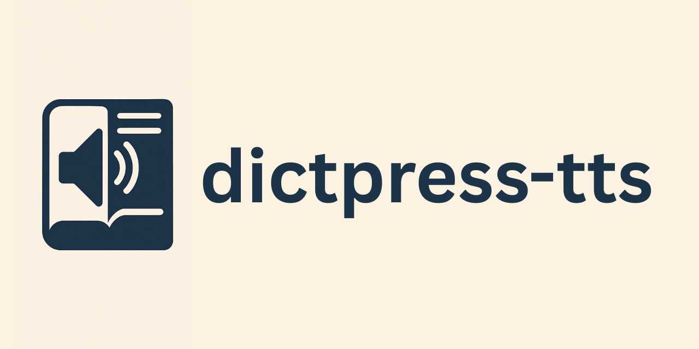

# dictpress-tts



[](https://github.com/Aditya-ds-1806/dictpress-tts/actions/workflows/build.yml)
[](https://github.com/Aditya-ds-1806/dictpress-tts/actions/workflows/release.yml)


**dictpress-tts** is a fast, portable, text-to-speech utility for [dictpress](https://github.com/knadh/dictpress). It converts word definitions to audio using cloud-based TTS providers.

---

## Integration with dictpress

`dictpress-tts` connects to the same PostgreSQL database used by DictPress, accessing the entries table to retrieve dictionary words and definitions. It then generates speech audio files for these entries using a configured voice engine, saving them to the specified output directory for easy integration.

---

## Features

- Supports Google TTS (other services can be added in the future)
- Handles TTS API rate limiting with configurable options
- Configurable via CLI flags or TOML

---

## Installation

Download a prebuilt binary from [Releases](https://github.com/Aditya-ds-1806/dictpress-tts/releases), or build from source:

```bash
make build
```

Then, either:

Move the binary to a directory in your PATH, such as `/usr/local/bin`:

```bash
mv dictpress-tts /usr/local/bin/
```

**OR**

Export the binary's location to your PATH (for the current session):

```bash
export PATH="$PATH:$(pwd)"
```

---

## Usage

Download the `config.sample.toml`, rename it to `config.toml`, and apply your configuration in it.


```text
$ ./dictpress-tts --help
      --config strings        path to one or more config files (will be merged in order) (default [config.toml])
      --lang string           language to filter words from database (empty for all languages)
      --last-id int           ID to resume from (fetch words with ID > last-id)
      --tts-provider string   TTS provider to use (overrides config file)
      --version               show current version of the build
```

---

## Example: Building a voice corpus with Google TTS

This is an example with which [Alar's voice corpus](https://github.com/Aditya-ds-1806/Alar-voice-corpus) can be built. Grab your Google TTS API Key and create a `[tts]` block in the dictpress TOML file. The `language_code` and `voice_name` can be obtained from [here](https://cloud.google.com/text-to-speech/docs/list-voices-and-types#list_of_all_supported_languages).

```toml
[tts.google]
api_key = "<YOUR-API-KEY-HERE>"
language_code = "kn-IN"
voice_name = "kn-IN-Standard-A"
output_format = "mp3"
```

Make sure your dictpress postgres database is up and running. In case you want to seed the DB with dummy data, you can run the `dump` shell script provided in the repository.

```bash
$ chod +x ./dump # give permission to run as executable
$ ./dump 10000 # optional, dumps 10000 dummy rows into postgres entries table
$ dictpress-tts --config=path/to/your/config.toml
```

This will create a `tts` folder and start writing `.mp3` audio files. Depending on the API rate limits and the size of the data, it may take a few minutes to a few hours to finish building the corpus.

---

## Running MacOS Binaries

On MacOS, Gatekeeper might prevent you from executing the binary. To prevent Gatekeeper from interfering, `com.apple.quarantine` attribute needs to be removed.

```bash
$ xattr -rd com.apple.quarantine ./dictpress-tts
```
